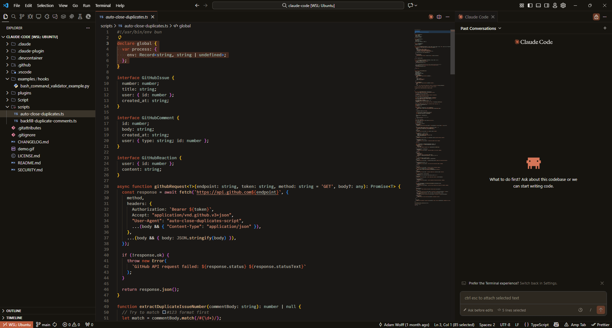

# Claude Theme

Warm, sophisticated dark and light themes for Visual Studio Code inspired by Claude's brand identity.

## Features

- **Warm Color Palette**: Built around Claude's brand colors
  - **Crail** `#C15F3C` - Warm terracotta for accents and highlights
  - **Cloudy** `#B1ADA1` - Warm gray-taupe for secondary elements
  - **Pampas** `#F4F3EE` - Warm off-white/cream for text
- **Both Dark and Light Modes**: Choose between warm dark browns or light cream backgrounds
- **Comfortable Backgrounds**: Reduce eye strain with carefully balanced warmth
- **Excellent Contrast**: Carefully selected colors meet WCAG AA standards
- **Comprehensive Syntax Highlighting**: Support for JavaScript, TypeScript, Python, Java, C/C++, CSS, HTML, Markdown, and more

## Preview

Both themes feature:
- Crail (`#C15F3C`) accent colors for focus states and active elements
- Sophisticated syntax highlighting with warm tones
- Consistent UI elements throughout VSCode

**Dark Theme**: Warm dark brown editor background (`#1a1816`)
**Light Theme**: Warm cream editor background (`#F4F3EE`)

## Installation

### From Source

1. Clone this repository
2. Copy the folder to your VSCode extensions directory:
   - **Windows**: `%USERPROFILE%\.vscode\extensions`
   - **macOS/Linux**: `~/.vscode/extensions`
3. Restart VSCode
4. Go to `Preferences > Color Theme` and select **Claude Dark** or **Claude Light**

### Manual Installation

1. Press `Ctrl+Shift+P` / `Cmd+Shift+P`
2. Type `Preferences: Color Theme`
3. Select **Claude Dark** or **Claude Light**

## Color Reference

### Primary Colors

| Color | Hex | Usage |
|-------|-----|-------|
| Crail | `#C15F3C` | Accent color, keywords, focus states |
| Cloudy | `#B1ADA1` | Variables, secondary text |
| Pampas | `#F4F3EE` | Base text (with adjustments) |

### UI Colors

**Dark Theme:**

| Element | Color |
|---------|-------|
| Editor Background | `#1a1816` |
| Sidebar Background | `#16140f` |
| Foreground Text | `#e8e6e3` |
| Borders | `#2b2621` |

**Light Theme:**

| Element | Color |
|---------|-------|
| Editor Background | `#F4F3EE` |
| Sidebar Background | `#ebe9e4` |
| Foreground Text | `#2d2820` |
| Borders | `#d4d0c8` |

### Syntax Colors

| Token | Color |
|-------|-------|
| Keywords | `#C15F3C` (Crail) |
| Comments | `#7a7469` |
| Strings | `#ce9178` |
| Functions | `#dab892` |
| Variables | `#B1ADA1` (Cloudy) |
| Types/Classes | `#9fb3a6` |
| Numbers | `#b5a890` |

## Contributing

Issues and pull requests are welcome! Please ensure:
- JSON is valid
- Colors maintain good contrast ratios
- Changes are tested across multiple file types

## License

MIT

## Credits

Inspired by Claude's warm and sophisticated brand identity.
